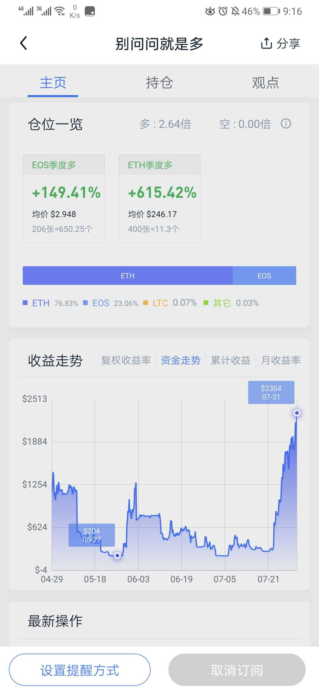
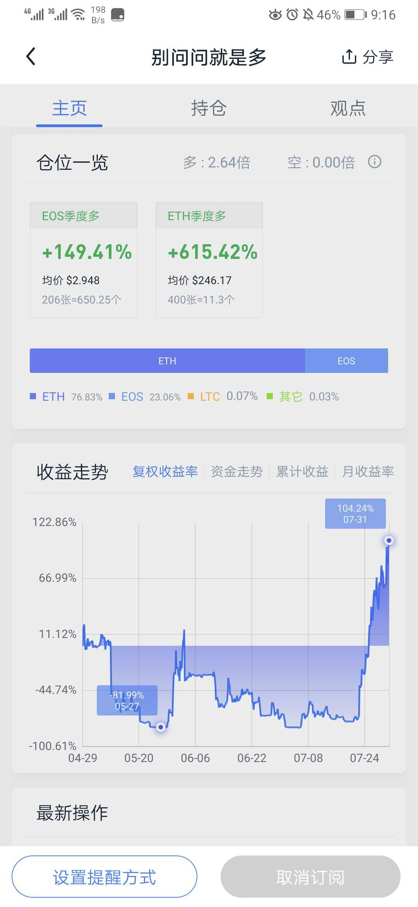

#

实盘的第三个月

> 介于目前时间精力都极其有限，一切以长话短写。尽量避免主观性表达，以客观为主

>> 同时这将作为月度总结的模板

# 资金管理策略

> 固定比率资金管理策略

初始金额 $800，
定义：
* 一份合同 = 4000U；
* 增量：$500

余额|累计盈利|需要盈利|可交易合同数
----|----|----|----|
800|0|0|1
1300|500|500|2
2300|1500|1000|3
4800|3000|1500|4

# 交易计划 与 记录

# 行情分析

> 行情分析放在 tradeview 

# 总结

## 月度总结

* 实盘情况
* 思考
* 那些是缺点跟不足的
* 是否可以改进以及如何改进
* 有什么优秀的地方
* 如何继续保持
* 结语

### 情况

整个前大半月市场都在不断的上下大小区间震荡，经历过很多次的假突破、假跌破。波动率与量价收敛跌破/突破 新区间震荡 随后又拉回/跌回， 交易系统不断的执行做多做空止损操作。 显然带来了极大的亏损。 与其说是实力，不如说是运气，最后最低已经到了200多刀 连基本单位 4000 用 20x 杠杆都快开不出来了。诚然还是迎来了曙光，市场在最后两周开始走高，突破区间上沿 买入开多坚定持有到现在，扭亏为盈,目前已经到了 2300 刀，收益率录得 187.5%，月收益率录得546.2%；这都得益于市场的眷顾。

诚然这背后是高达 75%的最大回撤率 这都是不能接受并且无法回避的迫切问题。

### 思考🤔

暂时没时间
交易哲学来说

不给盈利设限，但给止损设限

关于 是否应该给盈利设目标(设限) 的引发了很多的思考，目前没想通很多东西

### 缺点

> 缺点是一个老生常谈的话题，尤其是自己的缺点，还是在交易市场

总结一句话就是问题很多

- 还没有完全形成自己的一套交易体系
- 资金管理存在巨大漏洞
- 交易系统存在还有极大的优化空间
- 投入思考优化交易逻辑的时间精力不够
- 没有做交易记录
- 交易入场 止损 存在主观行为
- 市场上涨后害怕利润回测 出现了知行不合一，情绪接管了交易而不是逻辑

### 改进

- 利用时间先把《交易为生II 卖出的艺术》阅读完成
- 为接下来的每一笔交易做好交易计划跟记录，最好是能做评分
- 最好是能做出一套评分规则出来
- 减少交易次数，放大交易周期，剔除其他交易者的影响

### 如何保持

没有情感的交易机器

### 结语

> 回撤率 是我急切需要解决的问题

由于时间精力关系，很多问题没有进行深度思考，并不是不解决，预计10月份以后会得以好转；到时需把问题都深入思考解决掉，以录得更低的回撤率。

虽有很多不足，却也是还能接受，保持了交易系统坚定的执行了交易逻辑、保持着逻辑思考与逻辑一致性。路还很长...

