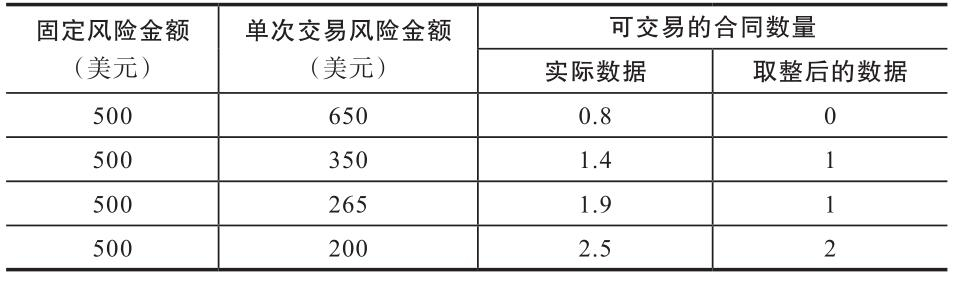

## 资金管理

### 资金管理的目的

* 生存——避免爆仓风险
  * 亏损情况下减少头寸规模
* 巨大利润——产生几何级数增长的利润
  * 盈利情况下扩大头寸规模

### 资金管理的模式

* 马丁格尔资金管理模式
* 返马丁格尔资金管理模式b

马丁格尔资金管理模式：
- 亏损时候加大头寸规模
- 盈利时减少头寸规模

>风险：增加了破产风险『不建议使用』

返马丁格尔资金管理模式

>正确的资金管理模式

特征：
* 呈几何级数增加的利润
* 非对称杠杆

非对称杠杆
>亏损时候需要更大的收益弥补亏损, e.g -50% 需要 100% 收益补回亏损

非对称公式（计算弥补亏损所需收益率）
>收益率 = 1/(1-损失率) - 1

### 理解关键概念

* 风险管理——资金管理
* 预期业绩——正期望

关键词概念
* 合同数量——自己定义的标准化计量单位。
e.g 规定 单个合同的固定资金单位为: $500。则 一份合同 = $500
* 风险临界比例（风险临界值）—— 你能承受的最大亏损比例

>资金管理 + 正预期系统 持续盈利

### 返马丁格尔资金管理模式

- 固定风险法
- 固定资金法
- 固定比率法
- 固定单位数法
- 威廉斯固定风险法
- 固定百分比法
- 固定波幅法

#### 固定风险法

对每笔交易限定一个预先确定的或者固定的风险金额

>> 固定风险金额 = 账户余额 / 资金单位数
>> 资金单位数: 即是交易次数

如何运用？
1. 确定资金单位数（交易次数）
2. 计算固定风险金额
3. 计算单次交易风险金额（入市价与止损价加上佣金）
4. 可交易合同数量（固定风险金额/单次交易风险金额）

e.g
账户余额 20000，资金单位：40个。
固定风险金额： 500。『只有当风险金额等于或小于 500 时才参与交易』

可交易合同数量

>显然「固定风险法」无法满足资金管理的目标

#### 固定资金法

固定资金法的交易合同有一个固定的资金单位

计算公式：

>>合同数量 = 账户余额 / 单个合同的固定资金单位

如何运用？
1. 计算固定资金单位（一份交易合同的金额）
2. 计算合同数量
3. 根据账户余额变化按规定增加或减少合同数量

如何计算固定资金单位以及合同数量?

>>固定资金单位 = 最大的跌幅实际或者预期 / 风险临界比例

>>合同数量 = 账户余额 / 固定资金单位

固定资金单位的计算
需要科学的计算，所以可以引入 最大的跌幅实际或者预期 / 风险临界比例 等概念帮助我们得到科学合理的固定资金单位。具体可以因人而异。

>这就是一个步长为『固定资金单位』的增长数列，账户总资金每增长一个『固定资金单位』就增加一份『可交易合同』反之亦然。
>满足了 『资金管理的目标』
>最大优势在于：
>让小额账户快速做大
>盈亏同源，操作风险也很大，同时也面临巨大亏损和回撤。

#### 固定比率资金管理
固定比率资金管理的核心：
>为自己定制一个增量，只有每个可交易合同数都盈利该增量时候才可以增加合同数，反之需要减少可交易合同数

1. 定制自己的增量
2. 定义标准化单位一份合同金额

余额 $800，
定义：
* 一份合同 = 4000U；
* 增量：$500

余额|累计盈利|需要盈利|可交易合同数
----|----|----|----|
800|0|0|1
1300|500|500|2
2300|1500|1000|3
4800|3000|1500|4

### 威廉斯固定资金管理

定义：
> 给定一个固定风险比例，计算出固定风险额，用固定风险金额/最大损失金额 取整得到可交易合同数量

变量：「固定风险比例」「最大损失金额」
公式
> 可交易合同数（头寸规模）= （账户余额 * 固定风险比例）/ 最大损失金额  *（取整）*

优点:
* 有较强的抗风险能力
* 也有较为满意的盈利能力

缺点：
* 只能大资金使用

### 其他方法不说了

# 总结
应该理解并且明白的

* 资金管理的目的是什么
* 理解多个资金管理策略的优缺点
* 如何去选择你的资金管理
* 验证你的资金管理系统
* 关于系统终止点

资金管理的目的
盈利时增大交易规模，亏损时减少交易规模（对抗爆仓风险、破产风险、灾难性损失的利器）

如何选择你的资金管理
- 个人账户规模
- 风险承受能力
- 单次交易风险
- 风险偏好

*每一个资金管理方法在实用之前都应该经过验证，你必须去验证他的可行性，并且观察他的各项能力*
- 爆仓风险
- 破产风险
- 抗灾难性损失能力
- 盈利能力
- 扩大头寸能力

关于系统终止点
为交易系统设置止损点！（这是我从来没想过的事）应该重视，应该为交易系统找到一个止损位，过了这个位置我们应该对交易系统进行重新验证或者说改进

# 关于感悟
本章于我最大的感悟就是
> 你一定要有一套科学的资金管理系统来管理你的资金，以应对这个市场
